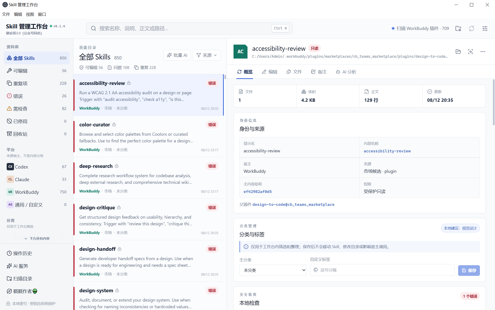
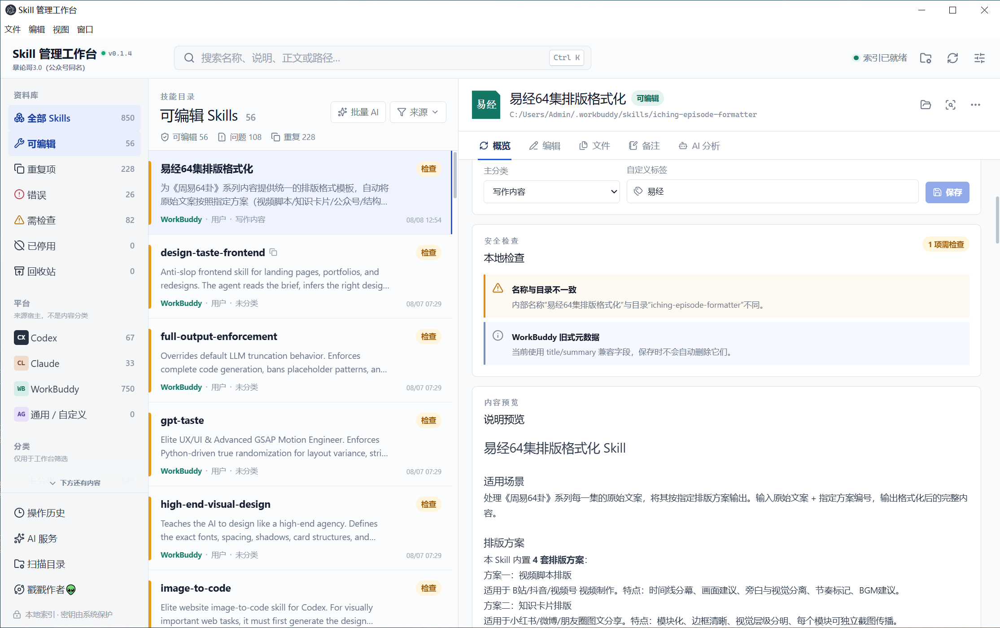
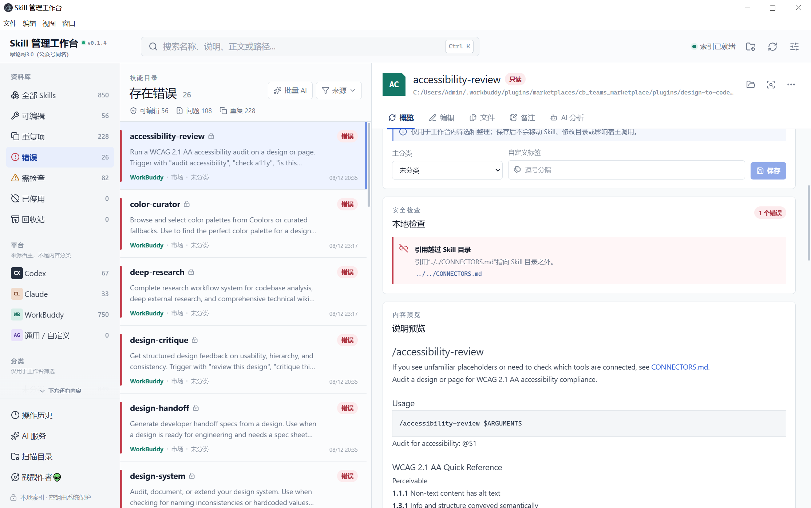
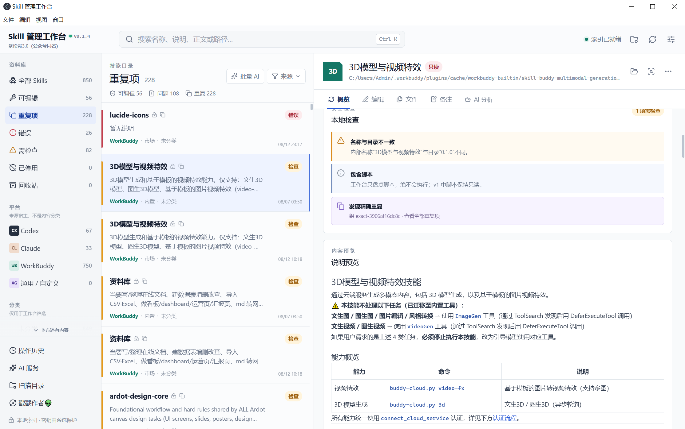
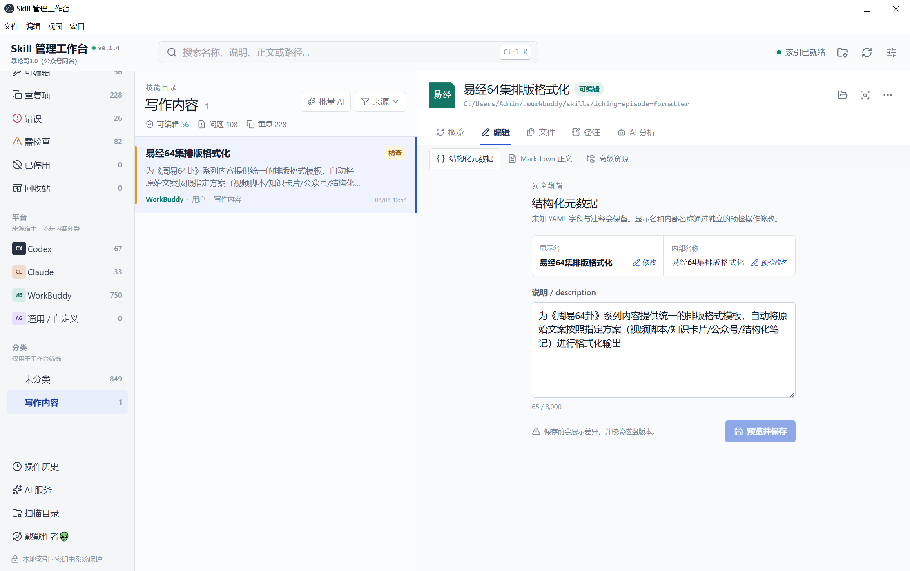
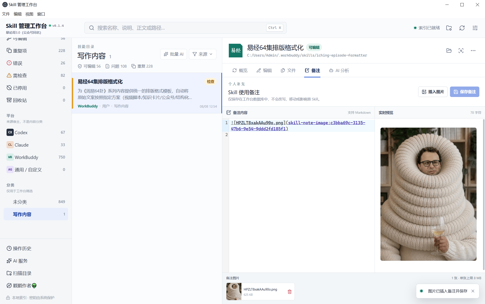

# Skill 管理工作台

Windows 优先的本地 Electron 应用，用统一索引管理 Codex、Claude、WorkBuddy 与项目目录中的 Skill。Skill 文件仍保留在原位置；数据库只保存索引、分类、标签、历史快照和 AI 分析结果。

## 软件预览

点击图片可查看完整尺寸。

<p align="center">
  <a href="docs/images/software-preview/overview.png">
    
  </a>
  <br>
  <sub>统一索引、来源识别、状态筛选与 Skill 详情概览</sub>
</p>

<table>
  <tr>
    <td width="50%" valign="top">
      <strong>可编辑 Skill 与内容预览</strong><br>
      <a href="docs/images/software-preview/editable-skill.png">
        
      </a>
    </td>
    <td width="50%" valign="top">
      <strong>本地安全诊断</strong><br>
      <a href="docs/images/software-preview/diagnostics.png">
        
      </a>
    </td>
  </tr>
  <tr>
    <td width="50%" valign="top">
      <strong>重复项识别</strong><br>
      <a href="docs/images/software-preview/duplicates.png">
        
      </a>
    </td>
    <td width="50%" valign="top">
      <strong>结构化元数据编辑</strong><br>
      <a href="docs/images/software-preview/structured-editor.png">
        
      </a>
    </td>
  </tr>
  <tr>
    <td colspan="2" valign="top">
      <strong>图片备注与实时预览</strong><br>
      <a href="docs/images/software-preview/image-notes.png">
        
      </a>
    </td>
  </tr>
</table>

## 已实现能力

- 自动发现用户级目录，并可添加项目根目录；区分用户、项目、插件、内置、市场、缓存、备份和回收站来源。
- 名称、说明、正文和路径搜索，以及平台、分类、来源、健康状态、可写性和重复项筛选。
- YAML、引用、文件体积、脚本/二进制、名称冲突、精确与近似重复等本地诊断；扫描过程不会执行 Skill 脚本。
- 安全 Markdown 预览、结构化元数据与正文编辑、文本资源高级编辑、并发冲突拦截和修改前差异确认。
- 显示名与内部名称分开修改；内部改名预检目录、宿主元数据和自引用。
- 工作台回收站、恢复、操作历史和文本快照；没有永久删除入口。
- 支持跟随系统、简体中文和英文界面；语言可在“软件设置 → 常规”即时切换并在重启后保持。
- Chat Completions 与 Responses 两种 AI 协议、发送内容预览、附件上限、结构化校验、结果缓存、任务取消，以及最多 20 个当前筛选结果的再次确认式批量分析。
- Electron 安全隔离、Zod IPC 参数校验、`safeStorage` 密钥加密和 Windows x64 打包。

## 开发与验证

要求 Node.js 24+，在 Windows PowerShell 中使用：

```powershell
npm.cmd install
npm.cmd start
npm.cmd run typecheck
npm.cmd test
npm.cmd run build
npm.cmd run test:e2e
npm.cmd run benchmark:scan
npm.cmd run make
npm.cmd run smoke:packaged
```

`npm.cmd run make` 会生成可直接解压运行的 ZIP，以及 Squirrel 安装器。因为旧版资源编辑器对中文工程路径兼容性不稳定，安装器阶段会自动复制到纯英文临时目录构建，再将最终产物复制回 `out/make`。

`npm.cmd run benchmark:scan` 会用隔离的临时数据库只读扫描当前 Windows 用户的默认 Skill 目录，输出实际数量与耗时，并在结束后删除临时索引；运行前需要先执行 `npm.cmd run build`。

`npm.cmd run smoke:packaged` 会隐藏启动 `out` 中的打包版，在隔离数据目录中检查主进程、沙箱渲染进程、SQLite 和随包原生模块，随后自动退出并清理测试数据。界面 API 与 Node 隔离由 `test:e2e` 覆盖。

## 数据与安全边界

- 打包版默认数据目录为 Electron 的 `userData` 目录，Windows 通常位于 `%APPDATA%\Skill 管理工作台`。
- 索引数据库为 `skill-workbench.sqlite3`，工作台回收站为同目录下的 `trash`。
- API Key 与自定义敏感请求头经 Electron `safeStorage` 加密后才写入数据库；界面和 IPC 不回传明文密钥。
- 用户和项目来源默认可写；插件、内置、市场、缓存和备份默认只读。
- 编辑保存使用同目录临时文件与原子替换；磁盘哈希与加载时不一致时会阻止覆盖。
- AI 分析必须手动触发，默认只发送 `SKILL.md`；脚本和二进制不会发送，也不会自动执行或改写 Skill。
- 界面语言不会翻译或改写 Skill 内容、路径、备注和自定义标签；AI 新分析结果会按当前界面语言生成，并与其他语言的缓存隔离。

完整设计见 [架构与安全边界](docs/架构与安全边界.md)，备份步骤见 [数据备份与恢复](docs/数据备份与恢复.md)，多语言测试分支证据与产物哈希见 [v0.2.0 多语言验收记录](docs/v0.2.0-i18n-验收记录.md)。

## v1 边界

当前面向 Windows 10/11 x64、单机单用户。未实现账号与云同步、团队权限、市场安装、插件强制卸载、Git 自动升级、Skill 脚本执行、AI 自动改写或代码签名。macOS/Linux 仅保留平台适配扩展点，未进行发布验证。
